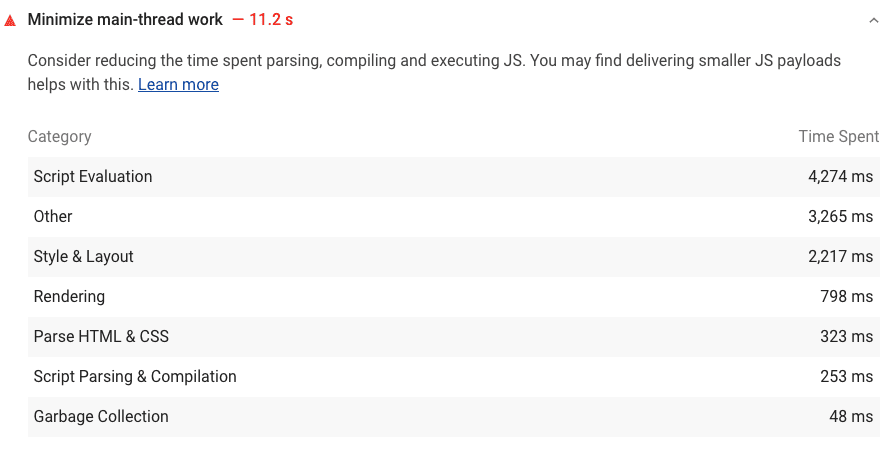
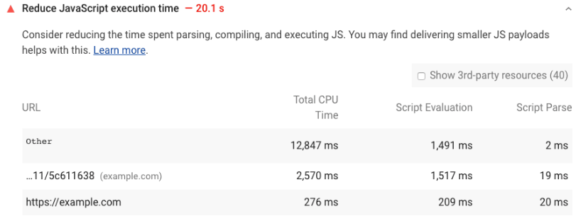

# 一、前端性能优化介绍

### 什么是 Web 性能

[MDN](https://developer.mozilla.org/en-US/docs/Learn/Performance/What_is_web_performance) ：Web 性能（web performance）是网站或应用程序的客观度量和可感知的用户体验。

- **减少总体加载时间** ：减少文件体积，减少 HTTP 请求数量、使用预加载
- **使网站尽快可用** ：仅加载首屏内容，其他内容根据需要进行懒加载
- **平滑和交互性** ：使用 css 动画代替 js 动画、减少 UI 重绘
- **感知表现** ：耗时操作要给用户反馈，比如 loading 动画、进度条、骨架屏等提示信息
- **性能测定** ：性能指标、性能测试、性能监控持续优化

Web 性能包括加载时间、每秒帧数和交互时间等 **客观度量** ，以及加载内容所需时间的 **主观体验** 。

### 为什么要关注 Web 性能

- 用户的留存
- 体验与传播
- 搜索排名
- 客户投诉
- 提升工作绩效
### 如何进行 Web 性能优化

1. 首先需要了解性能指标 - 多快才算快？
2. 使用专业的工具可量化地评估出网站或应用的性能表现
3. 然后立足于网站页面响应的生命周期，分析出造成较差性能表现的原因
4. 最后进行技术改造、可行性分析等具体的优化实施
5. 迭代优化

下面进行简单介绍。

#### 性能指标

Google 制定了一些标准：

- [RAIL 性能模型](https://web.dev/rail/)
- [基于用户体验的核心指标](https://web.dev/metrics/)
- [新一代型性能指标：Web Vitals](https://web.dev/vitals/)

#### 性能测量

通常我们会借助一些工具来完成性能测量：

- 浏览器 DevTools 调试工具
	- 网络监控分析
	- 性能监控分析
	- …
- 灯塔（Lighthouse）
	- 网站整体质量评估，并给出优化建议
- WebPageTest
	- 多测试地点
	- 全面的性能报告

#### 生命周期

网站页面的生命周期，就是经典的面试题 - **从浏览器的地址栏输入一个 URL 后，到整个页面渲染出来的过程** 。

整个过程包括 [域名解析](https://so.csdn.net/so/search?q=%E5%9F%9F%E5%90%8D%E8%A7%A3%E6%9E%90&spm=1001.2101.3001.7020) ，建立 TCP 连接，前后端通过 HTTP 进行会话，压缩与解压缩，以及前端的关键渲染路径等。

把这些阶段拆解开来看，不仅能容易的获得优化性能的启发，而且也能为今后的前端工程师之路构建出完整的知识框架。

网站页面加载的生命周期如下图：


#### 优化方案

- 从发出请求到收到响应的优化，比如 DNS 查询、HTTP 长连接、HTTP2、HTTP 压缩、HTTP 缓存等
- 关键渲染路径优化，比如是否存在不必要的重绘和回流
- 加载过程的优化，比如延迟加载，是否有不必需要在首屏展示的非关键信息，占用了页面加载的时间
- 资源优化，比如图片、视频等不同的格式类型会有不同的使用场景，在使用的过程中是否恰当
- 构建优化，比如压缩合并、基于 Webpack 构建优化方案等
[https://www.yuque.com/books/share/bee30889-85b8-442e-be5c-6c683f783e2f?#（密码：xa3i）](https://www.yuque.com/books/share/bee30889-85b8-442e-be5c-6c683f783e2f?#%EF%BC%88%E5%AF%86%E7%A0%81%EF%BC%9Axa3i%EF%BC%89) 《前端性能优化》

# 二、Web 性能指标

我们已经知道性能的重要性，但当我们讨论性能的时候，让一个网页变得更快，具体指哪些内容？

事实上性能是相对的：

- 对于一个用户而言，一个站点可能速度很快（在具有功能强大的设备的快速网络上），而对于另一个用户而言，一个站点可能会较慢（在具有低端设备的慢速网络上）。
- 两个站点可能会在完全相同的时间内加载，但一个站点似乎加载速度会更快（如果它逐步加载内容，而不是等到最后显示所有内容）。
- 一个网站可能加载很快，但在后来的用户交互会很慢。

所以在讨论性能的时候， **精确的、可量化的指标** 很重要。

但是，一个度量标准是基于客观标准并且可以定量地度量的，所以一个指标的好坏并不一定意味着是有用的。

对于 Web 开发人员来说，如何衡量一个 Web 页面的性能一直都是一个难题。

最初，我们使用 TTFB （Time to First Byte）、DomContentLoaded 和 Load 这些衡量文档加载进度的指标，但它们不能直接反应用户视觉体验。

为了能衡量用户视觉体验，Web 标准中定义了一些 [性能指标](https://so.csdn.net/so/search?q=%E6%80%A7%E8%83%BD%E6%8C%87%E6%A0%87&spm=1001.2101.3001.7020) ，这些性能指标被各大浏览器标准化实现，例如 [First paint](https://developer.mozilla.org/en-US/docs/Glossary/First_paint) （首次绘制）和 [First contentful paint](https://developer.mozilla.org/en-US/docs/Glossary/First_contentful_paint) （首次内容绘制）。还有一些由 Web 孵化器社区组（WICG）提出的性能指标，如 [Largest Contentful Paint](https://developer.mozilla.org/en-US/docs/Web/API/LargestContentfulPaint) （最大内容绘制）、 [Time to interactive](https://developer.mozilla.org/en-US/docs/Glossary/Time_to_interactive) （可持续交互时间）、 [First input delay](https://developer.mozilla.org/en-US/docs/Glossary/First_input_delay) （首次输入延迟）、 [First CPU idle](https://developer.mozilla.org/en-US/docs/Glossary/First_CPU_idle) （首次 CPU 闲置）。另外还有 Google 提出的 [First Meaningful Paint](https://developer.mozilla.org/en-US/docs/Glossary/first_meaningful_paint) （首次有意义的绘制）、 [Speed index](https://developer.mozilla.org/en-US/docs/Glossary/Speed_index) （速度指数），百度提出的 [First Screen Paint](https://www.w3.org/Submission/first-screen-paint/) （首屏可视时间）。

这些指标之间并不是毫无关联，而是在以用户为中心的目标中不断演进出来的，有的已经不再建议使用，有的被各种测试工具实现，有的则可以作为通用标准，有各大浏览器提供的可用于在生产环境测量的 API。

下面主要通过三个层面进行介绍：

- [RAIL 性能模型](https://web.dev/rail/) - 从用户体验的角度给定的体验标准（Response、Animation、Idle、Load）
- [基于用户体验的核心指标](https://web.dev/metrics/) - 基于 RAIL 下具体的指标方案
- [新一代型性能指标：Web Vitals](https://web.dev/vitals/) - 在以上指标方案的简化，重点 LCP（Largest Contentful Paint）、FID（First input delay）、CLS（Cumulative Layout Shift）。

## RAIL 性能模型

[RAIL](https://web.dev/rail/) 是 **Response** 、 **Animation** 、 **Idle** 和 **Load** 的首字母缩写，是一种由 Google Chrome 团队于 2015 年提出的性能模型，用于提升浏览器内的用户体验和性能。

RAIL 模型的理念是“以用户为中心，最终目标不是让您的网站在任何特定设备上都能运行很快，而是使用户满意”。


RAIL 名字的由来是四个英文单词的首字母：

- 响应（Response）：应该尽可能快速的响应用户，应该在 100ms 以内响应用户输入。
	- 所谓的响应并不是返回结果，而是给出用户可以感知的状态交互。
- 动画（Animation）：在展示动画的时候，每一帧应该以 16ms 进行渲染，这样可以保持动画效果的一致性，并且避免卡顿。
	- 差不多每秒 60 桢
- 空闲（Idle）：当使用 JavaScript 主线程的时候，应该把任务划分到执行时间小于 50ms 的片段中去，这样可以释放线程以进行用户交互。
	- JS 中将超过 50ms 的执行任务称为\*\*“长任务”\*\*，由于长任务在执行过程中没有办法响应用户交互，所以要尽量避免
- 加载（Load）：应该在小于 1s 的时间内加载完成你的网站，并可以进行用户交互。

> 根据网络条件和硬件的不同，用户对性能延迟的理解也有所不同。
> 
> **1s** 是基于性能比较好的 PC 电脑以及良好的网络环境所得到的指标，用户对此已经习以为常。
> 
> 而在 3G 连接速度较慢的移动设备上加载网络需要花费更多时间，因此移动用户通常更耐心，在移动设备上加载 **5s** 是一个更现实的目标。

这四个单词代表与网站或应用的生命周期相关的四个方面，这些方面会以不同的方式影响整个网站的性能。

### 用户对于延迟的感知

我们将用户作为之后 性能优化 的中心，首先需要了解用户对于延迟的反应。

用户感知延迟的时间，如下表所示：

| 延迟 | 用户感知 |
| --- | --- |
| 0 ~ 16ms | 人眼可以感知每秒 60 桢的动画，即每帧 16ms，除了浏览器将一帧画面会绘制到屏幕上的时间，网站应用大约需要 10ms 来生成一桢 |
| 0 ~ 100ms | 在该时间范围内响应用户操作，才会是流畅的体验 |
| 100 ~ 1000ms | 能够感觉到明显的延迟 |
| \> 1s | 用户的注意力将离开对执行任务的关注 |
| \> 10s | 用户感到失望，可能会放弃任务 |

### 响应 Response

指标：应该尽可能快速的响应用户，应该在 100ms 以内响应用户输入。

网站性能对于响应方面的要求是，在用户感知延迟之前接收到操作的反馈。比如用户进行了文本输入、按钮点击、表单切换以及启动动画等操作后，必须在 100ms 内收到反馈，如果超过 100ms 的时间，用户就会感知延迟。

看似很基本的用户操作背后，可能会隐藏着复杂的业务逻辑处理以及网络请求与数据计算。对此我们应当谨慎，将较大开销的工作放在后台异步执行，而即便后台要处理数百毫秒才能完成的操作，也应当给用户提供及时的阶段性反馈。

比如点击按钮向后台发起某项业务处理请求时，首先反馈给用户开始处理的提示，然后在处理完成的回调中反馈完成的提示。

### 动画 Animation

指标：在展示动画的时候，每一帧应该以 10ms 进行渲染，这样可以保持动画效果的一致性，并且避免卡顿。

前端所涉及的动画不仅有炫酷的 UI 特效，还包括滚动和触摸、拖动等交互效果，而这一方面的性能要求就是流畅。众所周知，人眼具有视觉暂留特性，就是光对视网膜所产生的视觉，在光停止作用后，仍能保留一段时间。

研究表明这是由于视神经存在反应速度造成的，其值是 1/24s，即当我们所见的物体移除后，该物体在我们眼中并不会立即消失，而会延续存在 1/24s 的时间。对动画来说，无论动画帧率由多高，最后我们仅能分辨其中的 30 桢，但越高的帧率会带来更好的流畅体验，因此动画要尽力达到 60fps 的帧率。

目前大多数设备的屏幕刷新率为 60次/秒，那么浏览器渲染动画或页面的每一帧的速率也需要跟设备屏幕的刷新率保持一致。所以根据 60fps 帧率的计算，每一帧画面的生成都需要经过若干步骤，一桢图像的生成预算为 16ms（1000ms / 60 ≈ 16.66ms），除去浏览器绘制新桢的时间，留给执行代码的时间仅 10ms 左右。如果无法符合此预算，帧率将下降，并且内容会在屏幕上抖动。此现象通常称为卡顿，会对用户体验产生负面影响。

可以打开 chrome 提供的示例页面查看效果，一直点击 add 10，直到蓝色方块的移送速度明显变慢： [Janky Animation](https://googlechrome.github.io/devtools-samples/jank/)

### 空闲 Idle

指标：当使用 JavaScript 主线程的时候，应该把任务划分到执行时间小于 50ms 的片段中去，这样可以释放线程以进行用户交互。

要使网站响应迅速、动画流畅，通常需要较长的处理时间，但以用户为中心来看待性能问题，就会发现并非所有工作都需要在响应和加载阶段完成，我们完全可以利用浏览器的空闲时间处理可延迟的任务，只要让用户感受不到延迟即可。利用空闲时间处理延迟，可减少预加载的数据大小，以保证网站或应用快速完成加载。

为了更加合理的利用浏览器的空闲时间，最好将处理任务按 50ms 为单位分组。这么做就是保证用户在发生操作后的 100ms 内给出响应。

### 加载 Load

指标：首次加载应该在小于 5s 的时间内加载完成，并可以进行用户交互。对于后续加载，则是建议在 2s 内完成。

用户感知要求我们尽量在 5s 内完成页面加载，如果没有完成，用户的注意力就会分散到其他事情上，并对当前处理的任务产生中断感。需要注意的是，这里在 5s 内完成加载并渲染出页面的要求，并非要完成所有页面资源的加载，从用户感知体验的角度来说，只要关键渲染路径完成，用户就会认为全部加载已完成。

对于其他非关键资源的加载，延迟到浏览器空闲时段再进行，是比较常见的渐进式优化策略。比如图片懒加载、代码拆分等优化手段。

## 基于用户体验的性能指标

[基于用户体验的核心指标](https://web.dev/metrics/) 是 Google 在 web.dev 提出的。

### First Contentful Paint（FCP）

[FCP（First Contentful Paint）](https://web.dev/fcp/) 首次内容绘制，浏览器 **首次绘制来自 DOM 内容** 的时间，内容必须是文本、图片（包含背景图）、非白色的 canvas 或 SVG，也包括带有正在加载中的 Web 字体的文本。


这是用户第一次开始看到页面内容，但仅仅有内容，并不意味着它是有用的内容（例如 Header、导航栏等），也不意味着用户要消费的内容。

#### 速度指标

| FCP 时间（以秒为单位） | 颜色编码 | FCP 分数（HTTP 存档百分位数） |
| --- | --- | --- |
| 0-2 | 绿色（快速） | 75-100 |
| 2-4 | 橙色（中等） | 50-74 |
| \>4 | 红色（慢） | 0-49 |

#### 优化方案

https://web.dev/fcp/#how-to-improve-fcp

### Largest Contentful Paint（LCP）

[LCP（Largest Contentful Paint）](https://web.dev/lcp/) 最大内容绘制， **可视区域中最大的内容元素呈现** 到屏幕上的时间，用以估算页面的主要内容对用户可见时间。

LCP 考虑的元素：

- `` 元素
- `<svg>` 元素内的 `<image>` 元素
- `<video>` 元素（封面图）
- 通过 `url()` 函数加载背景图片的元素
- 包含文本节点或其他内联级文本元素子级的块级元素

为了提供良好的用户体验，网站应力争使用 2.5 秒或更短的“最大内容绘制”。为确保您达到大多数用户的这一目标，衡量移动设备和台式机设备的页面加载量的第 75 个百分位数是一个很好的衡量标准。

以下是一些示例：


在以上两个时间轴中，最大的元素随内容加载而变化。在第一个示例中，新内容被添加到 DOM 中，并且更改了最大的元素。在第二个示例中，布局发生更改，以前最大的内容从视口中删除。

通常情况下，延迟加载的内容要比页面上已有的内容大，但不一定是这种情况。接下来的两个示例显示了在页面完全加载之前发生的最大内容绘制。

  


在第一个示例中，Instagram 徽标相对较早的加载，即使逐渐显示其他内容，它仍然是最大的元素。在第二个示例 Google 搜索结果页面示例中，最大的元素是一段文本，该文本在任何图像或徽标加载完成之前显示。由于所有单个图像均小于此段，因此在整个加载过程中，它始终是最大的元素。

> 在 Instagram 时间轴的第一帧中，您可能会注意到相机徽标没有被当作最大元素（周围没有绿色框）。那是因为它是一个 `<svg>` 元素，并且 `<svg>` 元素当前不被视为 LCP 候选对象。

#### 速度指标

| LCP 时间（以秒为单位） | 颜色编码 |
| --- | --- |
| 0-2.5 | 绿色（快速） |
| 2.5-4 | 橙色（中等） |
| \>4 | 红色（慢） |

#### 优化方案

https://web.dev/optimize-lcp/

### First Input Delay（FID）

[FID（First Input Delay）](https://web.dev/fid/) 首次输入延迟，从用户第一次与页面交互（例如点击链接、点击按钮等）到浏览器实际能够响应该交互的时间。

输入延迟是因为浏览器的主线程正忙于其他事情，所以不能响应用户。发生这种情况的一个常见原因是浏览器正忙于解析和执行应用程序加载的大量计算的 JavaScript。

首次输入延迟通常发生在第一次内容绘制（FCP）和可持续交互时间（TTI）之间，因为页面已经呈现了一些内容，但还不能可靠地交互。


如上图所示，浏览器接收到用户输入操作时，主线程正忙于执行一个耗时比较长的任务，只有当这个任务执行完成后，浏览器才能响应用户的输入操作。它必须等待的时间就是此页面上该用户的 FID 值。

例如，以下所有 HTML 元素都需要在响应用户交互之前等待主线程上正在进行的任务完成：

- 文本输入框，复选框和单选按钮（ `<input>` 、 `<textarea>` ）
- 选择下拉菜单（ `<select>` ）
- 链接（ `<a>` ）

#### 速度指标

| FID 时间（以毫秒为单位） | 颜色编码 |
| --- | --- |
| 0-100 | 绿色（快速） |
| 100-300 | 橙色（中等） |
| \>300 | 红色（慢） |

#### 优化方案

- https://web.dev/fid/#how-to-improve-fid
- https://web.dev/optimize-fid/

### Time to Interactive（TTI）

[TTI（Time to Interactive）](https://web.dev/tti/) 表示网页第一次 **完全达到可交互状态** 的时间点，浏览器已经可以持续性的响应用户的输入。完全达到可交互状态的时间点是在最后一个长任务（Long Task）完成的时间，并且在随后的 5 秒内网络和主线程是空闲的（没有长任务）。

从定义上来看，中文名称叫可持续交互时间或可流畅交互时间更合适。

> 需要 50ms 以上才能完成的任务称为 **长任务** 。


#### 速度指标

| TTI 时间（以秒为单位） | 颜色编码 |
| --- | --- |
| 0-3.8 | 绿色（快速） |
| 3.9-7.3 | 橙色（中等） |
| \>7.3 | 红色（慢） |

#### 优化方案

https://web.dev/tti/#how-to-improve-tti

### Total Block Time（TBT）

[TBT（Total Block Time）](https://web.dev/tbt/) 总阻塞时间，度量了 FCP 和 TTI 之间的总时间，在该时间范围内，主线程被阻塞足够长的时间防止输入响应。

只要存在长任务（该任务在主线程上运行超过 50ms），该主线程就会被视为“阻塞”。我们说主线程“被阻塞”是因为浏览器无法中断正在进行的任务。因此，如果用户确实在较长的任务中间与页面进行交互，则浏览器必须等待任务完成才能响应。

如果任务足够长（例如，超过 50ms 的任意时间），则用户很可能会注意到延迟并感觉页面缓慢或过时。

长任务的阻塞时间是其持续时间超过 50ms 的部分。页面的总阻塞时间是 FCP 和 TTI 之间发生的每个长任务的阻塞时间的总和。

例如，考虑页面加载期间浏览器主线程的下图：


上面的时间轴有五个任务，其中三个是长任务，因为它们的持续时间超过 50ms。

下图显示了每个长任务的阻塞时间：


因此，虽然在主线程上运行任务花费的总时间为 560ms，但只有 345ms 的时间被视为阻塞时间。

#### 速度指标

| TBT 时间（以毫秒为单位） | 颜色编码 |
| --- | --- |
| 0-30 | 绿色（快速） |
| 300-600 | 橙色（中等） |
| \>600 | 红色（慢） |

#### 优化方案

https://web.dev/tbt/#how-to-improve-tbt

### Cumulative Layout Shift（CLS）

[CLS（Cumulative Layout Shift）](https://web.dev/cls/) 累计布局偏移，CLS 衡量的是页面整个生命周期中每次元素发生的非预期布局偏移得分的总和。每次可视元素在两次渲染帧中的起始位置不同时，就当作发生了 LS（Layout Shift）。


试想这样一个场景，您想要点击一个链接或按钮，但是在手指落下的瞬间，链接移动了，您最终点击了其他东西！

页面内容的意外移动通常是由于异步加载资源或将 DOM 元素动态添加到现有内容的上方而发生的。罪魁祸首可能是尺寸未知的图像或视频，或是动态调整自身大小的第三方广告或小部件等。

#### 速度指标

| CLS 时间（以毫秒为单位） | 颜色编码 |
| --- | --- |
| 0-0.1 | 绿色（快速） |
| 0.1-0.25 | 橙色（中等） |
| \>0.25 | 红色（慢） |

#### 优化方案

- https://web.dev/cls/#how-to-improve-cls
- https://web.dev/optimize-cls/

### Speed Index（SI）

Speed Index（SI）速度指数，是一个表示页面可视区域中内容的填充速度的指标，可以通过计算页面可见区域内容显示的平均时间来衡量。

#### 测量方式

捕获浏览器加载页面过程的视频，然后对每 100ms 间隔的页面截图计算页面内容填充的百分比，可以得到这样一个曲线。


途中的 Example 1 和 Example 2 都是在 10s 时页面填充完成，但 Example 1 在 2s 时就已经填充了 80% 的内容，而 Example 2 在 8s 时才填充 80%。

图中阴影部分的面积（即时间-内容填充百分比曲线以上部分）的大小即可表示可视区域内页面内容的填充速度，面积越小，填充速度越快。

#### 速度指标

| 速度指标（以秒为单位） | 颜色编码 | 速度指数得分 |
| --- | --- | --- |
| 0-4.3 | 绿色（快速） | 75-100 |
| 4.4-5.8 | 橙色（中等） | 50-74 |
| \>5.8 | 红色（慢） | 0-49 |

#### 优化方案

https://web.dev/speed-index/#how-to-improve-your-speed-index-score

## Web Vitals

Google 开发了许多实用指标和工具，帮助衡量用户体验和质量，从而发掘优化点。一项名为 Web Vitals 的计划降低了学习成本，为网站体验提供了一组统一的质量衡量指标 —— Core Web Vitals，其中包括加载体验、交互性和页面内容的视觉稳定性。

有很多方法可以优化网站的用户体验。若能预先了解最佳的优化衡量方法，可以大大节省时间和成本。

Google 在 2020 年 5 月 5 日提出了新的用户体验量化方式 Web Vitals 来衡量网站的用户体验，并将这些衡量结果用作其排名 算法 的一部分。

### Core Web Vitals 与 Web Vitals

什么是 Web Vitals，Google 给出的定义是 **一个良好网站的基本指标（Essential metrics for a healthy site）** 。

过去要衡量一个网站的好坏，需要使用的指标太多了，Web Vitals 可以简化指标的学习曲线，只需聚焦于 Web Vitals 指标的表现即可。

在这些 Web Vitals 中，Google 确定了三个主要衡量指标，即在所有类型的网站中通用的 Core Web Vitals：


> Core Web Vitals 是应用于所有 Web 页面的 Web Vitals 的子集，是其最重要的核心。


| 指标 | 描述 | Good | Poor | Percentile |
| --- | --- | --- | --- | --- |
| 加载性能（LCP） | 显示最大内容元素所需时间 | ≤2500ms | ＞4000ms | 75 |
| 交互性（FID） | 首次输入延迟时间 | ≤100ms | \>300ms | 75 |
| 视觉稳定性（CLS） | 累计布局偏移 | ≤0.1 | \>0.25 | 75 |

### 测量 Web Vitals

- 性能测试工具，比如 Lighthouse
- 使用 [web-vitals](https://www.npmjs.com/package/web-vitals) 库
- 使用浏览器插件 [Web Vitals](https://chrome.google.com/webstore/detail/web-vitals/ahfhijdlegdabablpippeagghigmibma)

### 优化 Web Vitals

- [Optimize Largest Contentful Paint](https://web.dev/optimize-lcp/)
- [Optimize First Input Delay](https://web.dev/optimize-fid/)
- [Optimize Cumulative Layout Shift](https://web.dev/optimize-cls/)

### 参考链接

- [Web Vitals - web.dev](https://web.dev/vitals/)
- [解读新一代 Web 性能体验和质量指标](https://juejin.cn/post/6844904168591736846)
- [谷歌的新一代 Web 性能体验和质量指标：Web Vitals](https://www.uisdc.com/web-vitals)

# 三、Web 性能测试

作为网站应用的开发者或维护者，我们需要时常关注网站当前的健康状况，譬如在主流程运行正常的情况下，各方面性能体验是否满足期望，是否存在改进与提升的空间，如何进行快速且准确的问题定位等，为了满足这些诉求，我们需要进行全面且客观的性能检测。

### 性能检测的认知

性能检测作为 性能优化 过程中的一环，它的目的通常是给后续优化工作提供指导方向、参考基线及前后对比的依据。性能检测并不是一次性执行结束后就完成的工作，它会在检测、记录和改进的迭代过程中不断重复，来协助网站的性能优化不断接近期望的效果。

在展开介绍性能检测的方法和工具之前，我们首先需要破除有关性能的一些错误认知与理解偏差：

1. **不要通过单一指标就衡量网站的性能体验**。这是完全站在用户感知的角度上产生的认知，它只会有主观上的好与差，很难给出切实可行的优化建议。因此我们建议应当从更多维度、更多具体的指标角度来考量网站应用的性能表现，比如页面的首屏渲染时间，不同类型资源的加载次数与速度，缓存的命中率等。
2. **不要一次检测就得到网站性能表现的客观结果。** 网站应用的实际性能表现通常是高度可变的，因为它会受到许多因素的影响，比如用户使用的设备状况、当前网络的连接速度等，因此若想通过性能检测来得到较为客观的优化指导，就不能仅依赖一次检测的数据，而需要在不同环境下收集尽量多的数据，然后以此来进行性能分析。
3. **不要仅在开发环境中模拟进行性能检测。** 在开发环境中模拟进行的性能检测具有许多优势：比如可以很方面的制定当前检测的设备状况与网络速度，可以对检测结果进行重复调试，但因其所能覆盖的场景有限，会很容易陷入“幸存者偏差”，即所发现的问题可能并非实际的性能瓶颈。

据此可知，我们若想通过检测来进行有效的性能优化改进，就需要从尽可能多的角度对网站性能表现进行考量，同时保证检测环境的客观多样，能够让分析得出的结果更加贴近真实的性能瓶颈，这无疑会花费大量的时间与精力，所以在进行性能优化之前我们还需要考虑所能投入的优化成本。

### 常见的检测工具

- Lighthouse - Google 提供的检测工具，可以在很短的时间内生成一份性能测试报告，并且给出一些优化建议
- WebPageTest - 在世界各地的真实浏览器、设备和位置上测试，并且也能提供非常全面的性能测试报告以及网络请求的瀑布图。
- 浏览器 DevTools 开发工具
	- 浏览器任务管理器
	- Network 面板
	- Coverage 面板 - 代码覆盖率
	- Memory 面板 - 内存使用
	- Performance 面板
	- Performance monitor 面板 - 性能监视器
- 性能测量 API
- 持续的性能监控方案

## Lighthouse 灯塔

[lighthouse](https://www.npmjs.com/package/lighthouse) 直译过来是 “灯塔” 的意思，它是一个由 Google 开发并开源的 Web [性能测试工具](https://so.csdn.net/so/search?q=%E6%80%A7%E8%83%BD%E6%B5%8B%E8%AF%95%E5%B7%A5%E5%85%B7&spm=1001.2101.3001.7020) ，用于改进网络应用的质量。您可以将其作为一个 Chrome 扩展程序运行，或从命令行运行。您为 Lighthouse 提供一个您要审查的网址，它将针对此页面运行一连串的测试，然后生成一个有关页面性能的报告，并给出一些优化建议。

### 准备
参考： https://developer.chrome.com/docs/devtools/speed/get-started/
git 克隆下面地址 https://github.com/Tecode/front-end_learning/tree/39d9bcb0ba847488a2ce98124b2f02111676ee66/front_end_advanced/026-business-technology/04-web-performance

### 使用方式

Lighthouse 提供了多种使用方式：

- [在 Chrome DevTools 中使用](https://www.npmjs.com/package/lighthouse#using-lighthouse-in-chrome-devtools)
	- 只要您使用的是 Chrome 内核的浏览器（Chrome、Microsoft Edge 等），它们已经在 DevTools 中集成了 Lighthouse。
- [使用 Chrome 扩展](https://www.npmjs.com/package/lighthouse#using-the-chrome-extension)
	- 在 DevTools 中集成 Lighthouse 之前，Chrome 是以扩展的方式提供类似功能的，现在不需要单独安装扩展了。
- [使用 Node CLI 命令行工具](https://www.npmjs.com/package/lighthouse#using-the-node-cli)
- [使用 Node 包](https://www.npmjs.com/package/lighthouse#using-the-node-module)

### 性能报告

关于性能报告部分的检测结果，Lighthouse 给出的信息包括：检测得分、性能指标、优化建议、诊断结果及已通过的性能。

以 Microsoft Edge 为例：


首先选择测试的类别和设备，勾选清除存储（测试首次加载性能），点击生成报告开始生成。


#### 检测得分

经过检测，Lighthouse 会对上述五个维度给出一个 `0~100` 的评估得分，如果没有分数或得分为 0，则很有可能是检测过程发生了错误，比如网络连接状况异常等；如果得分能达到 90 分以上，则说明网站应用在该方面的评估表现符合最佳实践。

关于如何得到这个评估得分，Lighthouse 首先会获得关于评估指标的原始性能数据，然后根据指标权重进行加权计算，最后以数据库中大量的评估结果进行对数正态分布的映射并计算最终得分。

- [Lighthouse 计分计算器](https://googlechrome.github.io/lighthouse/scorecalc/)
- [Lighthouse performance scoring - web.dev](https://web.dev/performance-scoring/)


#### 性能指标

性能指标就是“[[#基于用户体验的性能指标]]”中的讲述的六个指标。

这六个指标数据通过加权计算，才能得到关于性能的最终评分，所加的权值越大表示对应指标对性能的影响就越大，如上图【Lighthouse 计分计算器】所示，列出了目前 Lighthouse 的权重情况（ **Weight** ）。

这6种不同的指标数据需要通过加权计算，才能得到关于性能的最终评分，所加的权值越大表示对应指标对性能的影响就越大，如下图所示，列出了目前 Lighthouse 的权重情况。  

| Audit                                                                  | Weight |
| ---------------------------------------------------------------------- | ------ |
| [First Contentful Paint](https://web.dev/first-contentful-paint/)      | 15%    |
| [Speed Index](https://web.dev/speed-index/)                            | 15%    |
| [Largest Contentful Paint](https://web.dev/lcp/)                       | 25%    |
| [Time to Interactive](https://web.dev/interactive/)                    | 15%    |
| [Total Blocking Time](https://web.dev/lighthouse-total-blocking-time/) | 25%    |
| [Cumulative Layout Shift](https://web.dev/cls/)                        | 5%     |

该权重系统还在不断优化过程中，虽然 Lighthouse 对于其中个别指标给予了较大的权重，也就意味着对该指标的优化能够带来更显著的性能评分提升，但这里还要建议在优化的过程中切勿只关注单个指标的优化，而要从整体性能的提升上来考虑优化策略。  

#### 优化建议

为了方便开发者更快的进行性能优化，Lighthouse 在给出关键性能指标评分的同时，还提供了一些切实可行的优化建议。

这些建议按照优化后预计能带来的提升效果从高到低进行排列，每一项展开又会有更加详细的优化指导建议，从上到下依次包括以下内容。  
  
**（1）移除阻塞渲染的资源**，部分JavaScript脚本文件和样式表文件可能会阻塞系统对网站页面的首次渲染，建议可将其以内嵌的方式进行引用，并考虑延迟加载。报告会将涉及需要优化的资源文件排列在下面，每个文件还包括尺寸大小信息和优化后预计提升首屏渲染时间的效果，据此可安排资源文件优化的优先级。  
  
**（2）预连接所要请求的源**，提前建立与所要访问资源之间的网络连接，或者加快域名的解析速度都能有效地提高页面的访问性能。这里给出了两种方案：一种是设置〈link rel="preconnect"〉的预连接，另一种是设置〈link rel="dns-prefetch"〉的DNS预解析，前面章节对这两种方案都有过讨论，此处就不再赘述了。  
  
**（3）降低服务器端响应时间**，通常引起服务器响应缓慢的原因有很多，因此也有许多改进方法：比如升级服务器硬件以拥有更多的内存或CPU，优化服务器应用程序逻辑以更快地构建出所需的页面或资源，以及优化服务器查询数据库等，不要以为这些可能并非属于前端工程师的工作范围就不去关注，通常node服务器转发层就需要前端工程师进行相应的优化。  
  
**（4）适当调整图片大小**，使用大小合适的图片可节省网络带宽并缩短加载用时，此处的优化建议通常对于本应使用较小尺寸的图片就可满足需求，但却使用了高分辨率的大图，对此进行适当压缩即可。  
  
**（5）移除未使用的CSS**，这部分列出了未使用但却被引入的 CSS 文件列表，可以将其删除来降低对网络带宽的消耗，若需要对资源文件的内部代码使用率进行进一步精简删除，则可以使用 Chrome 开发者工具的Coverage面板进行分析。

#### 诊断结果
[具体诊断信息](https://developer.chrome.com/docs/lighthouse/performance/total-byte-weight?hl=zh-cn)
这部分 Lighthouse 分别从影响网站页面性能的多个主要维度，对得到的一些数据进行详细检测和分析。

1）对静态资源文件使用高效的缓存策略，这里列出了所有静态资源的文件大小及缓存过期时间，开发者可以根据具体情况进行缓存策略的调整，比如延迟一些静态资源的缓存期限来加快二次访问时的速度。  


  
（2）减少主线程的工作，浏览器渲染进程的主线程通常要处理大量的工作：如解析 HTML 构建 DOM，解析 CSS 样式表文件并应用指定的样式，以及解析和执行 JavaScript 文件，同时还需要处理交互事件，因此渲染进程的主线程过忙很容易导致用户响应延迟的不良体验，Lighthouse 给我们提供了这一环节网站页面主线程对各个任务的执行耗时，让开发者可针对异常处理过程进行有目标的优化，如下图所示。  


（3）降低JavaScript脚本执行时间，前端项目的逻辑基本都是依托于JavaScript执行的，所以JavaScript执行效率与耗时也会对页面性能产生不小的影响，通过对这个维度的检测可以发现执行耗时过长的JavaScript文件，进而针对性的优化JavaScript解析、编译和执行的耗时，如图11.20所示。  

  
（4）避免存在较大尺寸网络资源的请求，因为如果一个资源文件尺寸较大，那么浏览器就需要等待其完全加载好后，才能进行后续的渲染操作，这就意味着单个文件的尺寸越大其阻塞渲染流程的时间就可能越长，并且网络传输过程中存在丢包的风险，一旦大文件传输失败，重新传输的成本也会很高，所以应当尽量将较大尺寸的资源进行优化，通常一个尺寸较大的代码文件可以通过构建工具打包成多个尺寸较小的代码包；对于图片文件如非必要还是建议在符合视觉要求的前提下尽量进行压缩。可以看出该检测维度列出的大尺寸资源文件，基本都是图片文件。  

  
（5）缩短请求深度，浏览器通常会对同一域名下的并发请求进行限制，超过限制的请求会被暂时挂起，如果请求链的深度过长，则需要加载资源的总尺寸也会越大，这都会对页面渲染性能造成很大影响。因此建议在进行性能检测时，对该维度进行关注和及时优化，如图11.22所示。

#### 已通过的性能

这部分列出的优化项为该网站已通过的性能审核项。

（1）延迟加载首屏视窗外的图片，该审核项的优化原理在有关图像优化章节有过详细的介绍，对首屏关键资源加载完毕后，延迟首屏外或处于隐藏状态的图片加载能够有效缩短用户可交互前的等待时间，提升用户访问体验。  
（2）压缩 CSS 文件，可降低网络负载规模。  
（3）压缩 JavaScript 文件，可降低网络负载规模。  
（4）对图片文件采用高效的编码方式，经过编码优化的图片文件，不但其加载速度会更快，而且需要传输的数据规模也会越小，详情可参考图像优化章节的内容。  
（5）采用新一代的图片文件格式，WebP、JPEG XR、JPEG 2000等较新的图片文件格式通常比传统的PNG或JPEG有更好的压缩效果，能够获得更快的下载速度和更少的流量消耗，但使用的同时还需要注意对新格式的兼容性处理。  
（6）开启文本压缩，对于文本资源，先压缩再提供能够最大限度地减少网络传输的总字节数，常用的压缩方式有 gzip、 deflate 和 brotli，至少采用其中一种即可。  
（7）避免多次页面重定向，过多的重定向会在网页加载前造成延迟。  
（8）预加载关键请求，通过 `<link rel="preload">` 来预先获取在网页加载后期需要请求的资源，这主要是为了充分利用网站运行的间歇期。  
（9）使用视频格式提供动画内容，建议通过 WebM 或 MPEG4 提供动画，来取代网站页面中大型 GIF 的动画。  
（10）避免 DOM 的规模过大，如果 DOM 规模过大，则可能会导致消耗大量的内存空间、过长的样式计算耗时及较高的页面布局重排代价。Lighthouse 给出的参考建议是，页面包含的 DOM 元素最好少于1500个，树的深度尽量控制不要超过32层。  
（11）确保在网页字体加载期间文本内容可见，使用 CSS 的 font-display 功能，来让网站页面中的文本在字体加载期间始终可见。
### Lighthouse 练习案例

#### 下载和运行案例

Chrome Developers 中有一篇 [《Optimize website speed》](https://developer.chrome.com/docs/devtools/speed/get-started/) ，里面提供了一个需要性能优化的案例网站： [server.js – tony](https://glitch.com/edit/#!/tony) 。

这是一个在线开发案例项目，由于网络原因可能访问很慢，导致测试不够真实，可以将项目代码下载到本地。

> 可以使用我下载好的代码： [usaliva/lighthouse-learn-case](https://gitee.com/usaliva/lighthouse-learn-case) 。  
> master 分支是初始代码，learn 分支是优化后的代码。

首先需要登录（支持 Github 账号登录），然后点击 Remix this project，将项目复制到账户下


自动跳转页面后点击下面的 TOOLS - Import / Export


弹出的面包提供了 git 地址，将其 clone 到本地即可。


下载到本地后 `npm install` 安装依赖，然后 `npm start` 或 `npm run develop` 构建项目并启动，成功后访问 `http://localhost:1234` ，效果如下：


Lighthouse 性能检测报告结果（建议使用 InPrivate 隐私浏览模式）：


加载的资源大小如下：


下面开始逐步优化。

#### 启用文本压缩

按照建议启用文本压缩：


安装 Express 的中间件开启 Gzip 压缩。

```shell
npm install compression
```

```js
// server.js
const express = require('express');
const app = express();
const fs = require('fs');
const compression = require('compression');

// 注意要放在配置静态资源路径前面
app.use(compression());

app.use(express.static('build'));

const listener = app.listen(process.env.PORT || 1234, function () {
  console.log(\`Listening on port ${listener.address().port}\`);
});

```
 
重新启动应用 `npm start` ，点击 Lighthouse 面板的 `+` 新增测试报告，保留之前的报告结果：


可以看到性能评分提高了一些：


加载的资源大小如下：


如 lodash.js、jquery.js，尤其是 bundle.js 的大小都明显变小。

#### 压缩图片

当前使用的图片资源是未压缩的：


改为压缩过的：

```js
// src\model.js
const base = '/imgs';
const width = 1500;
// const dir = 'big';
const dir = 'small'; // 使用压缩过的图片

...
1234567
```

需要重新构建 `npm start` ，查看资源大小：


Lighthouse 检测报告：


#### 移除阻塞渲染的资源


当前案例中并没有使用 lodash.js 和 jquery.js，页面在加载它们的时候会阻塞主线程，所以将其移除优化性能：

```html
<!-- template.html -->
<!DOCTYPE html>
<html lang="en">
  <head>
    <meta charset="utf-8">
    <meta http-equiv="X-UA-Compatible" content="IE=edge">
    <meta name="viewport" content="width=device-width, initial-scale=1">
    <!-- 移除未使用的 JavaScript -->
    <!-- <script src="/libs/lodash.js"></script>
    <script src="/libs/jquery.js"></script> -->
    <title>Tony's Favorite Foods</title>
  </head>
  <body>
    <div id="main"></div>
  </body>
</html>

1234567891011121314151617
```

`npm start` 重新构建并检测：


#### 减少未使用的 JavaScript


当前案例使用 webpack 的 `development` 模式打包，将其修改为 `production` 模式，这个模式下会移除未使用的 JS：

```js
// webpack.config.js
const path = require('path');
const HtmlWebpackPlugin = require('html-webpack-plugin');
const CopyWebpackPlugin = require('copy-webpack-plugin');

module.exports = {
  // mode: "development",
  mode: "production",
  ...
};

1234567891011
```

`npm start` 重新构建并检测：


Total Blocking Time 的到了极大的提升，bundle.js 也优化到了 76kb 左右：


#### 减少主线程工作


当前案例手动添加了一些占用主线程的无意义的脚本，如 `src/App.jsx` 下执行的 `mineBitcoin()` ，将其注释：

```js
// src\App.jsx
...

class App extends React.Component {
  constructor(props) {
    super(props);
    // 占用主线程 1.5s
    this.mineBitcoin(1500);
  }
  mineBitcoin(duration) {
    const start = new Date().getTime();
    while (new Date().getTime() < start + duration) {
      // TODO(tony): Make $$$
    }
  }
  render() {
    ...
  }
}

export default App;

12345678910111213141516171819202122
```

`npm start` 重新构建并检测：


## WebPageTest

[WebPageTest](https://www.webpagetest.org/) 是一款非常专业的 Web 页面性能分析工具，它可以对检测分析的环境配置进行高度自定义化，内容包括测试节点的物理位置、设备型号、浏览器版本、网络条件和检测次数等。

除此之外，它还提供了目标网站应用于竞品之间的性能比较，以及查看网络路由情况等多种维度下的测试工具。

### 基本使用

可以直接打开 [官方网站](https://www.webpagetest.org/) 的首页，在配置好目标网站应用的网址和检测参数后便可启动测试， **可能需要排队** ，等待检测运行结束就能查看详细的测试报告。

> 由于是在线工具，这种方式只能测试已经发布上线的页面。

以 https://www.taobao.com/ 为例：


详细参考官方文档 - [Quick Start Guide](https://docs.webpagetest.org/getting-started/) 。

这是官网对自己测试的报告结果： [Webpage Performance Test Result](https://www.webpagetest.org/result/220401_BiDcVQ_E2V/)

也可以部署本地 WebPageTest： [Private Instances](https://docs.webpagetest.org/private-instances/)

## Chrome DevTools

Chrome DevTools 主要讲的是 F12 开发人员工具提供的功能，浏览器默认只展示了几个功能面板（如 Elements、 Console 、Sources、Network等），可以通过工具栏打开更多工具，也可以使用快捷键 `Ctrl + Shift + P` 打开运行命令工具，输入工具名称快速打开。

### 浏览器任务管理器

通过 Chrome 任务管理器，我们可以查看当前 Chrome 浏览器中所有进程关于 GUP、网络和内存空间的使用情况。这些进程包括当前打开的各个页签，安装的各种扩展插件，以及 GPU、网络、渲染等浏览器默认进程。通过监控这些数据，我们可以在有异于其他进程的大幅开销出现时，定位到可能存在 内存泄漏 或网络资源加载异常的问题进程。

以 Edge 为例，点击 **…（设置及其他） - 更多工具 - 浏览器任务管理器** ，快捷键 `Shift + ESC` 。


### Network 网络

Network 面板是 Chrome 开发者工具中一个经常会被用到的工具面板，通过它可以查看网络所有资源的请求情况，包括加载时间、尺寸大小、优先级设置及 HTTP 缓存触发情况等信息，从而帮助我们发现可能由于未进行有效压缩而导致资源尺寸过大的问题，或者未合理配置缓存策略导致二次请求加载时间过长的问题等。


> 检测性能建议勾选上图功能。


除了查看网络请求信息，还可以进行缓存测试、网络吞吐测试（模拟低速网络）、阻止网络请求等。

参考：[devtools/network](https://developer.chrome.com/docs/devtools/network/)

### Coverage 覆盖范围

我们可以通过 Coverage 面板监控并统计出网站应用运行过程中代码执行的覆盖率情况。该面板统计的对象是 JavaScript 脚本文件与 CSS 样式表文件，统计结果主要包括：每个文件的字节大小、执行过程中已覆盖的代码字节数，以及可视化的覆盖率条形图。

根据执行结果我们能够发现，在启动录制的过程中到底有哪些尺寸较大的代码执行覆盖率较低，这就意味着有些代码文件中可能存在较多的无用代码，更准确地说是暂时没用到的代码。这些信息对性能优化来说是非常有用的，开发者可以据此将执行覆盖率较低的代码进行拆分，将首屏渲染阶段暂时不会执行到的代码部分单独打包，仅在需要的时候再去加载。

同时对规模较大且迭代周期较长的项目来说，工程代码中会包含一些永远都不会执行到的代码，而使用 webpack 的 Tree Shaking 仅能根据 export 进行无关联引用，那么此时 Coverage 面板就为优化提供了一条可以尝试的途径。


### Memory 内存

前端主要使用 JavaScript 代码来处理业务逻辑，所以保证代码在执行过程中内存的良性开销对用户的性能体验来说尤为重要，如果出现内存泄漏，那么就可能带来网站应用卡顿或崩溃的后果。

为了更细致和准确地监控网站应用当前的内存使用情况，Chrome 浏览器开发者工具提供了 Memory 面板，通过它可以快速生成当前的堆内存快照，或者查看内存随时间的变化情况。据此我们可以查看并发现可能出现内存泄漏的环节。

示例：

```html
<!DOCTYPE html>
<html lang="en">
<head>
  <meta charset="UTF-8">
  <meta http-equiv="X-UA-Compatible" content="IE=edge">
  <meta name="viewport" content="width=device-width, initial-scale=1.0">
  <title>内存泄漏分析示例</title>
</head>
<body>
  <h1>内存泄漏分析示例</h1>
  <div id="app">
    <button id="run">运行</button>
    <button id="stop">停止</button>
  </div>
  <script>
    const arr = []

    for (let i = 0; i < 20000; i++) {
      arr.push(i)
    }

    let newArr = []

    function run() {
      newArr = newArr.concat(arr)
    }

    let clearRun

    document.querySelector('#run').onclick = function() {
      clearRun = setInterval(() => {
        run()
      }, 1000)
    }

    document.querySelector('#stop').onclick = function() {
      clearInterval(clearRun)
    }

  </script>
</body>
</html>
```

浏览器打开页面，点击“运行”，打开 Memory 面板，选择“时间线上额分配检测”，点击“开始”：


面板会持续记录堆内存使用快照情况，点击“停止记录”按钮，可以查看具体信息：


上面记录的内存使用大小呈上升趋势，正常情况应该是一个平缓的过程，有升（内存占用）有降（内存释放），下面通过“卷影大小”可以看到内存占用的情况，从而定位到 `newArr` 。

### Performance 性能

使用 Performance 面板主要对网络应用的运行时性能表现进行检测与分析，其可检测的内容不仅包括页面的每秒帧数（FPS）、CPU 的消耗情况和各种请求的时间花费，还能查看页面在前 1ms 与后 1ms 之间网络任务的执行情况等内容。

#### 使用方式

示例： [Janky Animation](https://googlechrome.github.io/devtools-samples/jank/)

> 建议使用隐私模式打开页面，因为隐私模式不会收到既有缓存或其他插件程序等因素的影响，能够给性能检测提供一个相对干净的运行环境。

点击页面 “Add 10” 增加动画图标直到动画有点卡顿，打开 Performance 面板，点击“录制”按钮，等待 3 秒（需要检测性能的时间段），点击“停止录制”按钮，相应的检测信息便出现在控制面板下方的区域：


#### 面板信息

Performance 评估结果的面板信息大致分为四类：控制面板、概览面板、线程面板及统计面板。

#### 控制面板

（1）Screenshots（屏幕截图）：是否截取每一帧的屏幕截图，勾选后会在概览面板中展示随时间变化的每帧截屏画面。


（2）Memory（内存）：是否记录内存消耗，勾选后会在线程面板与统计面板之间展示各种类型资源的内存消耗曲线。


（3）Web Vitals（网页指标）：是否展示性能指标信息，勾选后会在网络和 Frames（帧） 之间展示核心指标的节点状态。


（4）Disable JavaScript samples（禁用 JavaScript 示例）：勾选则表示关闭 JavaScript 示例，减少在手机端运行时的开销，若要模拟手机端的运行环境则需要勾选。

（5）Enable advanced paint instrumentation(slow)（启用高级画图检测工具(慢速)）：勾选则表示开启加速渲染工具，用来记录渲染事件的相关细节。因为该功能比较消耗性能，所以开启后重新生成检测报告的速度会变慢。

（6）Network（网络）：在性能检测时，用以切换模拟网络环境（网速）。

（7）CPU：限制 CPU 处理速度，主要用于模拟低速 CPU 运行时的性能（\* 倍减速）。

#### 概览面板

在概览面板的时间轴上，可以通过鼠标左键选择一定时间范围，来进行更小范围的性能观察，也可以用鼠标滚动（或 W/S 键）缩放查看范围，通过 A/D 左右移动。

这部分可观察的性能信息包括：

（1）FPS（每秒帧数）：尽量保持在 60fps 才能让动画有比较流畅的视觉体验。

*示例：可以看到基本都是红色，绿色表示性能较佳的情况。*

（2）CPU（CPU 开销）：可以在时间轴上以曲线的形式观察 CPU 处理任务所花费的时间变化，除此之外还可以在 **统计面板** 中查看当前选中时间区域里各个任务花费时间的占比，其中占比较大的部分就有可能存在性能问题，可以进一步检测与分析。

*示例：可以看到几乎被充满（紫色部分），说明 CPU 一直在大量占用。*

（3）NET（网络请求）：概览面板提供的信息可能不够清晰，建议在 **线程面板** 的 Network 部分中具体查看，比如时间轴上每个请求的耗时及起止时间，从而方便开发者发现响应过长的网络请求并进行优化。


*示例：因为当前示例没有资源请求，所以没有内容。*

#### 线程面板

（1）Frames（桢）：查看每一帧的详细信息，包括绘制画面，绘制时间，如果出现红色或黄色，则表示有丢帧的情况。

（2）Experience（体验）：显示布局发生切换的频率。

（3）Main（主要）：展示主线程执行过程中 CPU 运行的火焰图，主线程在解析 HTML 和 CSS、页面绘制及执行 JavaScript 的过程中，每个事件调用堆栈和耗时的情况都会反应在这张图上。

> 在 CPU 执行的过程中发生的所有事情都称为 **事件** 。

其中每个长条都代表了一个事件，将鼠标悬浮其上可以查看相应事件的执行耗时和事件名。

x 轴表示执行时间，y 轴表示调用栈的情况，从上到下调用，越往下事件数量越少，所以火焰图是倒立的形式。

火焰图中的事件会以不同颜色进行标注，常见的事件类型有以下集中：HTML 解析、JavaScript 事件（例如鼠标点击、滚动等）、页面布局更改、元素样式重新计算及页面图层的绘制。如果任务右上角标红，则表示该任务是超过了 50ms 的长任务。

最下面紫色的部分是 Layout 重排的任务，可以放大后点击，在 Summary（摘要）查看是什么导致的页面重排：


了解并熟知这些事件的执行情况，有助于发现潜在的性能问题。

（4）其他线程

#### 统计面板

统计面板会根据在概览面板中选择的时间范围，绘制出不同类型任务执行耗时的可视化图表。

统计面板包含四个页签：

（1）Summary（摘要）：展示各类任务事件耗时的环形图。

（2）Bottom-Up（自下而上）：查看各个事件耗时时间的排序列表，列表包含两个维度：去除子事件后该事件本身的耗时和包含子事件从开始到结束的总耗时。


（3）Call Tree（调用树）：查看全部或指定 Main 火焰图中某个事件的调用栈。


（4）Event Log（事件日志）：查看关于每个事件的详细日志信息。


#### 保存和加载

测试结果可以下载保存，也可以上传加载在面板中显示。


### Rendering 绘制面

Rendering 面板中有一个 **FPS 监视器** 可以在页面运行时提供对 FPS 的实时监测。

在面板中勾选 Frame Rendering Stats（渲染桢统计信息），就会在窗口中显示一个监视器叠加层：


Frame Rate 实时显示当前绘制帧率，如果有红线表示有丢帧的情况。

可以点击页面的 “Optimize” 开启优化模式，查看优化效果。

### Performance monitor 性能监视器

虽然使用 Performance 面板来进行监测能够得到较为全面的性能数据，但依然存在两个使用上的问题，即面板信息不够直观和数据的实时性不够强。

为了弥补这两个不足，Chrome 从 64 版本开始便在开发者工具中引入了 Performance monitor 面板，通过它让我们可以实时监控网站应用运行过程中，诸如 CPU 占用率、JavaScript 内存使用大小、内存中挂载的 DOM 节点数、JavaScript 事件监听次数及页面发生重绘与重排的处理时间等信息。

据此如果我们发现，当与页面的交互过程中出现某项指标有较为陡峭的增长，就意味着可能有影响性能体验的风险存在。


如图，通过增减 DOM 节点，DOM 节点数发生了明显波动，开启优化模式后 CPU 占用呈断崖式下跌。

### 参考

- https://developer.chrome.com/docs/devtools/
- https://developer.chrome.com/docs/devtools/evaluate-performance/
- [分析运行时性能入门 - Microsoft Edge Development | Microsoft Docs](https://docs.microsoft.com/zh-cn/microsoft-edge/devtools-guide-chromium/evaluate-performance/)

## 性能测量 API

浏览器提供了 Web 性能相关的 API，通过它们可以获取和计算常用的性能指标。

### 详细参考

- [Web 性能 | MDN](https://developer.mozilla.org/zh-CN/docs/Web/Performance)
- [Using the Performance API - Web APIs | MDN](https://developer.mozilla.org/en-US/docs/Web/API/Performance_API/Using_the_Performance_API)
- [self.performance - Web APIs | MDN](https://developer.mozilla.org/en-US/docs/web/api/performance_property)

### 常用性能指标及计算公式

- DNS 解析耗时：domainLookupEnd - domainLookupStart
- TCP 连接耗时：connectEnd - connectStart
- SSL 安全连接耗时：connectEnd - secureConnectionStart
- 网络请求耗时（TTFB）：responseStart - requestStart
- 数据传输耗时：responseEnd - responseStart
- DOM 解析耗时：domInteractive - responseEnd
- 资源加载耗时：loadEventStart - domContentLoadedEventEnd
- First Byte 时间：responseStart - domainLookupStart
- 白屏时间：responseEnd - fetchStart
- 首次可交互时间：domInteractive - fetchStart
- DOM Ready 时间：domContentLoadEventEnd - fetchStart
- 页面完全加载时间：loadEventStart - fetchStart
- HTTP 头部大小：transferSize - encodedBodySize
- 重定向次数：redirectCount
- 重定向耗时：redirectEnd - redirectStart

## 性能监控方案

- [前端性能监控开源方案](https://www.jianshu.com/p/a87c2e84bd56)
- [如何进行 web 性能监控？ | AlloyTeam](http://www.alloyteam.com/2020/01/14184/)
- [前端性能监控实践](https://juejin.cn/post/6844904094616780813)
- [前端性能监控及推荐几个开源的监控系统](https://cloud.tencent.com/developer/news/682347)
- [蚂蚁金服如何把前端性能监控做到极致?\_前端\_杨森](https://www.infoq.cn/article/dxa8am44oz*lukk5ufhy)
- [你是如何搭建 Web 前端性能监控系统的？](https://www.zhihu.com/question/37585246)
- [Chrome DevTools Performance 功能详解本文整理介绍 Chrome DevTools Perfo - 掘金](https://juejin.cn/post/7112544960934576136#heading-0)

## 其它参考文章
- 前端性能优化清单
	- \[[译\] 2019 前端性能优化年度总结 — 第一部分](https://zhuanlan.zhihu.com/p/55431529)
	- 2020 前端性能优化清单
		- [2020前端性能优化清单（一）](https://cloud.tencent.com/developer/article/1621632)
		- [2020前端性能优化清单（二）](https://cloud.tencent.com/developer/article/1622123)
		- [2020前端性能优化清单（三）](https://cloud.tencent.com/developer/article/1623930)
		- [2020前端性能优化清单（四）](https://cloud.tencent.com/developer/article/1623997)
		- [2020前端性能优化清单（五）](https://cloud.tencent.com/developer/article/1623998)
		- [2020前端性能优化清单（六）](https://cloud.tencent.com/developer/article/1624000)
	- [2021 前端性能清单（原文）](https://www.smashingmagazine.com/2021/01/front-end-performance-2021-free-pdf-checklist/)
- [谷歌开发者 - Web 性能优化](https://web.dev/fast/)
- https://web.dev/rail/
- [Web 性能 | MDN](https://developer.mozilla.org/zh-CN/docs/Web/Performance)
- [Web页面全链路性能优化指南](https://mp.weixin.qq.com/s/wJxj5QbOHwH9cKmqU5eSQw)
- [我是如何将网页性能提升5倍的 — 构建优化篇](https://juejin.cn/post/6910893471339708429)
- [关于多线程的简要介绍（英文）](https://www.internalpointers.com/post/gentle-introduction-multithreading)
- [前端性能优化 24 条建议（2020）](https://segmentfault.com/a/1190000022205291)
- [轻松实现 Web 性能优化](https://zhuanlan.zhihu.com/p/48298490)
- [嗨，送你一张Web性能优化地图](https://github.com/berwin/Blog/issues/23)
- [硬件加速中的“层”和层叠上下文中的“层”，是一个东西吗？](https://juejin.cn/post/7119136400465330184)