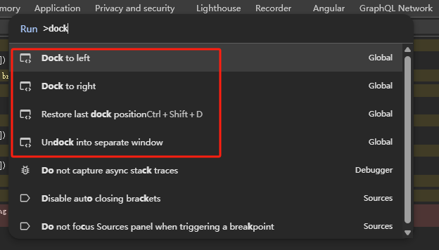
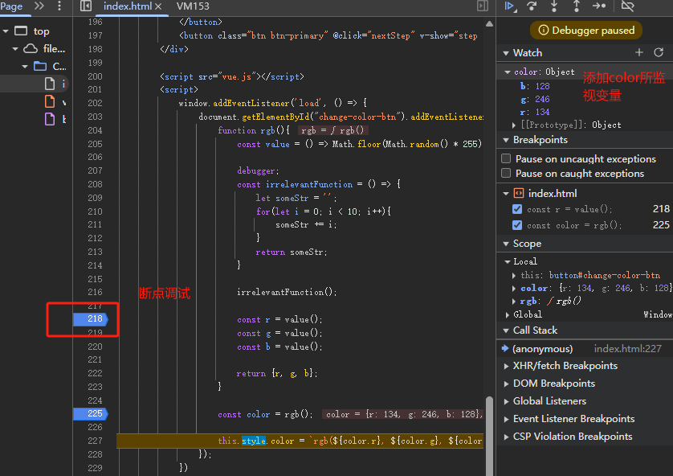
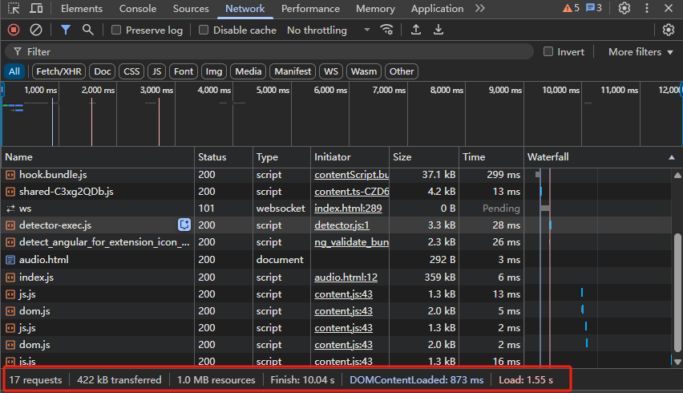

# Chrome DevTools使用技巧
## 打开Dev tool
菜单 > 跟多工具 > 开发者工具
快捷键：F12

[Chrome DevTools Performance 功能详解](https://juejin.cn/post/7112544960934576136)

## 打开commod命令菜单
快捷键：
- win：`CTRL + SHIFT + P`
- mac：`Command + SHIFT + P`

切换dev tools主题：输入`theme `


浏览器截图：输入`screenshot`对浏览器页面截屏

- area screenshot 区域选择截图
- full size screenshot 将整个页面从上到下完整截图
- node screenshot 选择页面dom元素截图
- screenshot 当前浏览器视窗大小

devtools位置：输入`dock`设置开发者工具位置

- dock to left左侧显示
- dock to right右侧显示
- undock into separate window脱离窗口单独显示

## Css调试
### 审查元素
选择中元素，鼠标右击检查元素`检查`

- 蓝色背景为元素本体
- 橙色背景为外边距
- 绿色背景为内边距

### 查询dom树
- 快捷键：
	- `CTRL+F`
	- `Command+F(MAC)`
- 文本查找：section_one查找元素对象


### Css选择器
通过`section#section_two` 元素标签通过id查找。

### Xpath查找
`//section/p`，先全局查找section标签，再查找p标签，同时查找到`1 of 7`个p元素


### Console面板查找元素
`inspect(document.getElementById('section_two'))`查找section_two元素


### 编辑样式
选中样式对dom元素添加样式 `//section/p`


`user agent stylesheet`表示浏览器内置样式


`Inherited from xxx` 从父元素中继承

`Pseudo ::before element`定义的伪元素

hover鼠标常驻

取消某个dom样式，点击`text-primary`移除这个样式

复制某一个dom样式，选择`Copy styles`


Computed面板中，当前Dom元素上所有生效的样式

### 查看页面布局
通过layout进行查看分为grid布局和flex布局

- Show track sizes 查看网格空间的大小
- Show area names 显示每个网格的名称
- Extend grid lines 将网格辅助线延长，便以观察其他元素的定位

查看flex布局，当点击时会出现flex布局阴影部分

flex布局可以通过点击不同的属性，改变排版布局

## 查看监听事件
`Event Listeners`查看全局监听事件

## 查看dom节点的属性

div.snack-box继承于 HTMLDivElement，HTMLDivElement又继承HTMLElement最后又继承到原型链最顶层Object上的

## 控制台（Console）
快捷键打开console
- Ctrl+Shift+J
- Command+Option+J(MAC)

- 执行语句

- $_ 上一条语句

- $0 上一个选择的DOM节点（$1, $2...）
当鼠标移动点击到某个元素时，通过$0获取元素

- console.log (error warn table clear group time assert trace)
error提示错误信息
warn提示警告信息
clear清空console里的内容

group组的形式展示
```js
console.group('test group')
console.log(1)
console.log(2)
console.groupEnd('test group')
```

time 测试一段代码的时间
```js
console.time()
let sum =0;
for(let i=0;i<=999;i++){
	sum += i;
}
console.timeEnd()
```


table 把一个数组，已一个表格的方式进行呈现出来


监测某段代码的变量


## Debugger调试模式
在js代码中中添加`Debugger pasused`模式

当给代码添加断点时，会变为`Paused on breakpoint`


给dom元素添加的监听debugger
- subtree modifications：已button为根节点，该节点里的子节点被修改了，执行js运行就会被暂停
- attribute modifications：这个节点的属性被修改了，执行js代码也会被暂停
- node removal：节点被删除了，执行js代码运行就会被暂停


处于`Paused on attribute modifications`模式
给button添加`attribute modifications`js调试，点击button按钮发生dom属性变化时，js会进入调试模式


当使用vue框架时，比如点击调试时候，想要忽略vuejs源码文件，调试自己写的js代码就需要下图：


## Network网络控制面板
name：页面资源名称
status：网络响应状态码
type：文件资源类型文本、js、css、xhr
initiator：什么资源发起了请求
size：响应的资源大小
time：发起请求的时间
Waterfall：一些响应时间，比如收到服务器的响应等待时间


stop recording network log（红色按钮），点击时停止监听页面相关资源请求响应
clear：清空所有network面板的网络请求信息

### 筛选选项
- Fetch/XHR：只包括网络请求和响应的信息
- Doc：筛选文本信息
- CSS：筛选css样式资源文件
- Js：筛选JavaScript资源
- Font：所使用的字体资源
- Img：页面说使用的图片资源
- WS：筛选websocket资源
- Wasm：‌筛选WebAssembly资源

Preserve log，比如两个页面直接进行跳转，当跳转另一个页面时，上一个页面的请求信息就消失了，当勾选后会保留上一个页面的请求历史记录
Disable cache：禁用页面的缓存

### 网络截流器
比如，当前的环境网络速度比较快的，但是其他用户使用的是3G网络，模拟在3G网络环境下页面的加载情况。


User-Agent
比如后端要根据不同的设备型号，不同的设备进行特殊的处理，通过more network添加User agent，devtools就可以模拟网页的请求头部


### Waiterfall
比如Queueing 在队列里花费了多少时间
Waiting for server response 等待服务器响应所花费的时间


### 页面自己加载请耗时情况
发起了17个请求，在传输的时候页面被压缩成422kb，传输过来的成功文件大小时1.0MB，整个传输完成时花费10.04s秒，Dom节点渲染完毕873ms，整个页面的加载1.55s秒

